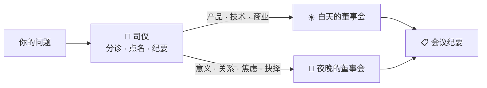

<div align="center">

# 🌙 智囊团 MCP

### *Wise Council —— 一场横跨东西方 2500 年的董事会*

[](https://modelcontextprotocol.io)
[](#-两扇窗两张桌)
[](#-白天的董事会事业之桌)
[](#-夜晚的董事会人生之桌)
[](#-许可证)

**白天，你问张小龙怎么砍功能；夜晚，你问庄子怎么面对三十五岁的自己。**

**[设计哲学](#-设计哲学)** · **[快速开始](#-快速开始)** · **[圆桌流程](#️-圆桌会议流程)** · **[席位名单](#-两扇窗两张桌)**

</div>

---

## 💡 设计哲学

> **Meta 花几千万美元请明星做的 AI 角色，一年就死了。**
> 因为它卖的是"名人皮"——皮做得越像，内核越空。

智囊团不扮演名人，只提供**方法论思维**：

| 统一 ✅ | 碰撞 ❌（绝不统一） |
|:---|:---|
| 话题 —— 全场只议论**你的问题** | 方法论 —— 俞军用公式，老子用比喻，Linus 用毒舌 |
| 形式 —— 发言契约：【立场】【理由】【反问】 | 价值观 —— 张小龙求克制 × 尤雨溪求演进 |
| 纪要 —— 共识 / 分歧 / 问题 / 行动项 | 结论 —— 分歧 = 你决策的真实风险面 |

**统一的是琴，碰撞的是曲。** 回音室没有价值，分歧才是你付费购买的东西。

---

## 🪟 两扇窗，两张桌

一个司仪（分诊台），自动把问题路由到正确的桌子：



### ☀️ 白天的董事会（事业之桌）

| 席位 | 顾问 | 一句话 |
|:---|:---|:---|
| 产品 | 张小龙 · 俞军 | "用户真的需要吗？" |
| 设计 | Don Norman · Steve Krug | "别让用户思考" |
| 架构 | Linus · Fowler · Uncle Bob · 尤雨溪 · Guido | "Talk is cheap" |
| 测试 | James Bach | 探索性测试之父 |
| 运维/云 | Kelsey Hightower · Werner Vogels · 王坚 | |
| 数据 | Stonebraker · DJ Patil · 周靖人 | |
| 性能 | Brendan Gregg · 杨涛 | |
| 安全 | Bruce Schneier · 吴翰清 | |
| 写作 | 阮一峰 | |

### 🌙 夜晚的董事会（人生之桌）

| 席位 | 顾问 | 独门绝活 |
|:---|:---|:---|
| 意义 | **弗兰克尔** · **加缪** | 集中营里写出《活出生命的意义》/ 西西弗斯的幸福 |
| 心理 | **阿德勒** · **荣格** · **爱比克泰德** | 课题分离 / 中年转型与阴影 / 控制二分法 |
| 东方 | **老子** · **庄子** · **王阳明** | 道法自然 / 无用之用 / 知行合一 |
| 兵法与治理 | **孙子** · **鬼谷子** · **韩非子** | 先胜后战 / 揣摩读人 / 赏罚二柄 |
| 生活 | **杨绛** · **史铁生** | "不要紧" / "死是一个必然会降临的节日" |

> **🪑 第 39 席 · 永久列席**：**65 岁的你** —— 不在点名表里，却出席每一场夜晚桌。所有智者发言完毕后，未来的你压轴开口："三十年后……"。全网竞品有名人 AI、有心理陪伴，没有一个是*你自己*。

### ♾️ 两桌共用（理性审计席）

**卡尼曼**（认知偏差审计）+ **芒格**（逆向思维）——任何决策都逃不过这两位的审计。

---

## 🕵️ 圆桌会议流程

```
你提问 → 司仪分诊 → 点名 3-5 位 → 圆桌发言（各持立场，严禁趋同）→ 会议纪要
```

**真实内测示例**：

> **问**：32 岁了，体制内稳定但一眼望到头，要不要裸辞去追自己想要的生活？很焦虑
>
> **司仪分诊**：🌙 夜晚的董事会 · 命中【焦虑内耗、职业人生】
> **点名**：庄子 · 爱比克泰德 · 阿德勒 · 王阳明 · 荣格
>
> 每人一段发言（立场 / 理由 / 反问），最后输出纪要：
> **共识 · 分歧 · 留给你的问题 · 本周行动项 · 一句收束**

### 🛟 安全红线

司仪内置心理危机信号识别。检测到重度痛苦信号时，纪要强制插入专业心理援助提示——**董事会提供视角，不提供心理治疗。** 这是产品的道德底线。

---

## 🚀 快速开始

```bash
git clone https://github.com/Dream22180971/wise-council-mcp.git
cd wise-council-mcp
npm install && npm run build
```

注册到 Claude Desktop / 任何 MCP 宿主：

```json
{
  "mcpServers": {
    "wise-council": {
      "command": "node",
      "args": ["<你克隆的目录>/wise-council-mcp/dist/index.js"]
    }
  }
}
```

然后直接说：

> *"开一场圆桌：我的博客要不要加评论功能？"* —— 白天桌自动就座
> *"开一场圆桌：要不要接受那个外地 offer"* —— 夜晚桌自动就座

### 六个工具

| 工具 | 用途 |
|:---|:---|
| `roundtable` ⭐ | 圆桌会议（自动分诊 + 点名 + 纪要），**日常用这个** |
| `consult` | 单独咨询某位顾问 |
| `review` / `critique` | 方案审查 / 犀利批评 |
| `brainstorm` / `suggest` | 头脑风暴 / 人选推荐 |

---

## 🗺️ 路线图

- [x] v1.0 —— 22 位技术专家 + 5 个工具
- [x] v2.0 —— 夜晚桌 16 席 + 司仪分诊 + 圆桌会议
- [x] v2.1 —— 第 39 席：65 岁的你，永久列席夜晚桌压轴发言
- [ ] v2.2 —— 会议存档接入 [agent-memory-hub](https://github.com/Dream22180971/agent-memory-hub)（董事会开始记住你）
- [ ] v3.0 —— 圆桌剧场 Web 界面 + 观点星云可视化
- [ ] v3.x —— 决策长廊（每一次圆桌成为一间展厅，你自己的史记）

---

## 📄 许可证

MIT © Dreamer

<div align="center">

**白天问事业，夜晚问人生。同一个董事会，两扇窗。** 🌗

</div>
