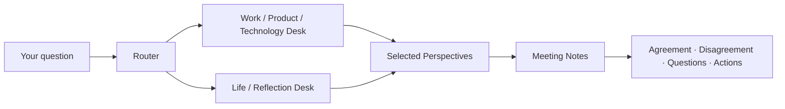

<div align="center">

# Wise Council MCP

**Bring multiple contrasting decision frameworks into one MCP-powered council.**

[English](./README.md) | [简体中文](./README.zh-CN.md)

[](https://modelcontextprotocol.io)
[](https://www.typescriptlang.org/)
[](./package.json)
[](#license)

</div>

---

## 🎯 What it is

Wise Council MCP is an MCP server that routes one question through multiple **methodology-based perspectives** instead of forcing a single synthetic answer.

The emphasis is on structured disagreement:

- different frameworks inspect the same question
- each perspective states a position and reasoning
- the final output preserves agreement, disagreement and open questions
- the user keeps the final decision

---

## 🔄 How it works



The project intentionally avoids collapsing every perspective into one “perfect answer”. The disagreement is part of the output.

---

## ⚡ Quick Start

```bash
git clone https://github.com/Dream22180971/wise-council-mcp.git
cd wise-council-mcp

npm install
npm run build
npm start
```

For development:

```bash
npm run dev
```

---

## 🧩 Design

The server separates three responsibilities:

| Layer | Role |
|---|---|
| Router | decide which desk / perspective set fits the question |
| Council | generate independent structured viewpoints |
| Minutes | summarize agreements, disagreements, unresolved questions and actions |

A perspective is treated as a reasoning method, not as an attempt to impersonate a real person.

---

## 📋 Output Contract

A useful response format is:

```text
[Position]
What this perspective would prioritize.

[Reasoning]
Why it sees the problem this way.

[Question]
What it would ask before deciding.
```

Meeting notes then preserve:

- common ground
- unresolved disagreements
- assumptions
- questions for the user
- concrete next actions

---

## 🧠 MCP Use Cases

- product trade-offs
- architecture discussions
- career decisions
- writing critique
- risk review
- decision pre-mortems
- “what am I missing?” prompts

The tool is designed to add perspectives, not make decisions on behalf of the user.

---

## 🛠 Project Commands

```bash
npm run dev
npm run build
npm start
```

---

## 🗺 Roadmap

- [x] MCP server skeleton
- [x] Question routing
- [x] Multiple perspective sets
- [x] Structured meeting notes
- [ ] Configurable perspective packs
- [ ] User-defined councils
- [ ] Better trace / observability
- [ ] Evaluation set for routing quality
- [ ] More MCP client examples

---

## 🤝 Contributing

Useful contributions include new methodology packs, routing tests, output-contract improvements and MCP client examples.

---

## 📄 License

MIT

<div align="center">

**One question. Several frameworks. The decision stays yours.**

</div>
