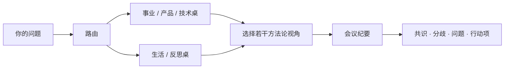

<div align="center">


# 智囊团 MCP · Wise Council

**通过 MCP，把不同方法论放进同一场结构化讨论。**

[English](./README.md) | [简体中文](./README.zh-CN.md)

[](https://modelcontextprotocol.io)
[](https://www.typescriptlang.org/)
[](./package.json)
[](#许可证)

</div>

---

## 它是什么

Wise Council MCP 是一个 MCP Server。它不会把问题压成一个“统一答案”，而是让多个 **方法论视角** 独立看同一个问题。

重点是保留结构化分歧：

- 不同方法论检查同一个问题
- 每个视角独立给出立场和理由
- 最终纪要保留共识、分歧和待确认问题
- 最终决定仍然由用户自己完成

---

## 工作方式



这个项目故意不把所有观点揉成一个“正确答案”。分歧本身就是信息。

---

## 快速开始

```bash
git clone https://github.com/Dream22180971/wise-council-mcp.git
cd wise-council-mcp

npm install
npm run build
npm start
```

开发模式：

```bash
npm run dev
```

---

## 设计

Server 把流程分成三层：

| 层 | 作用 |
|---|---|
| 路由 | 判断问题更适合哪组视角 |
| 圆桌 | 让不同方法论独立输出 |
| 纪要 | 汇总共识、分歧、假设、问题与行动项 |

项目强调“方法论”，而不是模仿某个真实人物本人。

---

## 输出契约

单个视角建议使用：

```text
【立场】
这个视角会优先考虑什么。

【理由】
为什么它会这样判断。

【反问】
做决定之前还需要确认什么。
```

会议纪要保留：

- 共识
- 分歧
- 隐含假设
- 留给用户的问题
- 下一步行动项

---

## 适合的 MCP 场景

- 产品取舍
- 架构讨论
- 职业选择
- 写作评审
- 风险审查
- Pre-mortem
- “我还漏掉了什么”类问题

它的目标是增加视角，不替用户做决定。

---

## 项目命令

```bash
npm run dev
npm run build
npm start
```

---

## 路线图

- [x] MCP Server 骨架
- [x] 问题路由
- [x] 多视角讨论
- [x] 结构化会议纪要
- [ ] 可配置方法论包
- [ ] 用户自定义 Council
- [ ] 更好的调用链可观测性
- [ ] 路由质量评测集
- [ ] 更多 MCP Client 示例

---

## 参与贡献

欢迎新增方法论包、路由测试、输出契约改进和 MCP Client 示例。

---

## 许可证

MIT

<div align="center">

**一个问题，多种框架，决定仍然属于你。**

</div>
